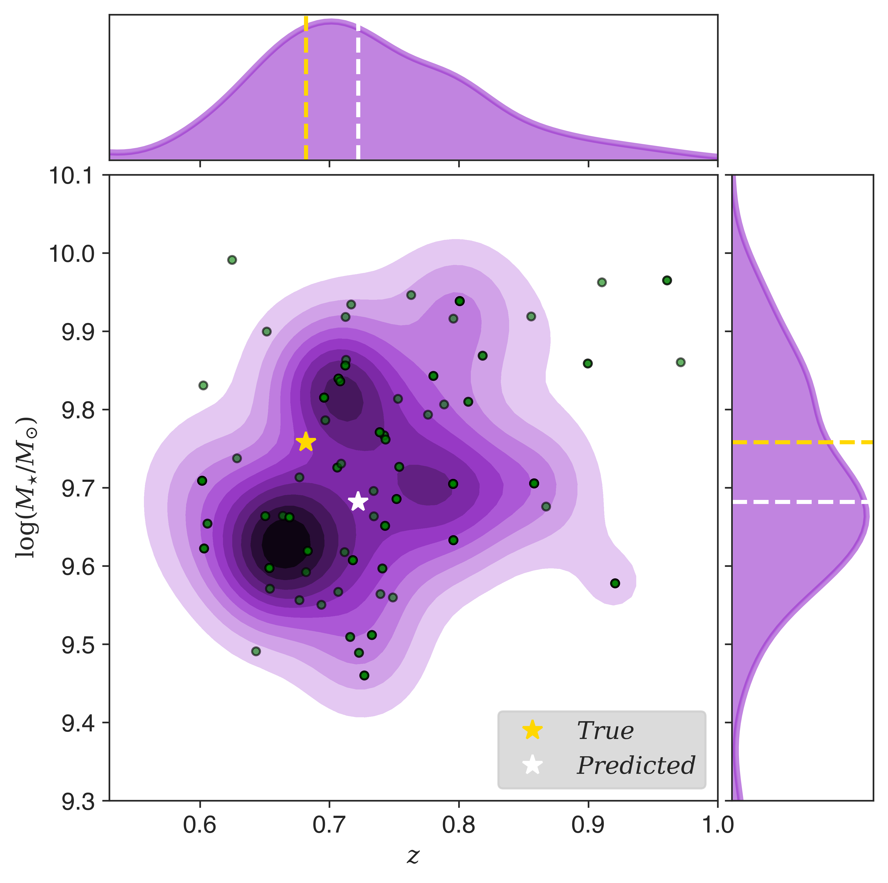

Galpro
======

Galpro is a novel Python machine learning code based on the Random Forest algorithm for estimating 
multivariate posterior probability distributions of galaxy properties (e.g. redshift, stellar mass,
star formation rate, metallicity).

Joint redshift - stellar mass posterior PDF
(See `Mucesh et al. 2020 <https://arxiv.org/abs/2012.05928>`_).

Installation
------------
Galpro is hosted on PyPI and can be installed using::

   pip install galpro

The latest source code is available on `GitHub <https://github.com/smucesh/galpro>`_.

Getting started
---------------
To become familiar with the package, we recommend going through example `Ipython notebooks <https://github.com/smucesh/galpro>`_.
For ease of use, Galpro is built around a single core class :ref:`Model <model>`.

Acknowledgements
----------------
Galpro is built on top of other excellent Python packages such as:

- `scikit-learn <https://scikit-learn.org/stable/>`_: for implementing the random forest algorithm.
- `joblib <https://joblib.readthedocs.io/en/latest/>`_: for saving and loading a trained random forest model.
- `h5py <https://joblib.readthedocs.io/en/latest/>`_: for reading and writing PDFs to disk.

Citation
--------
If you use Galpro in your research, please include a citation to this work
(`Mucesh et al. 2020 <https://arxiv.org/abs/2012.05928>`_) in any of your publications.

.. toctree::
   :maxdepth: 2
   :hidden:

   self
   model.rst
